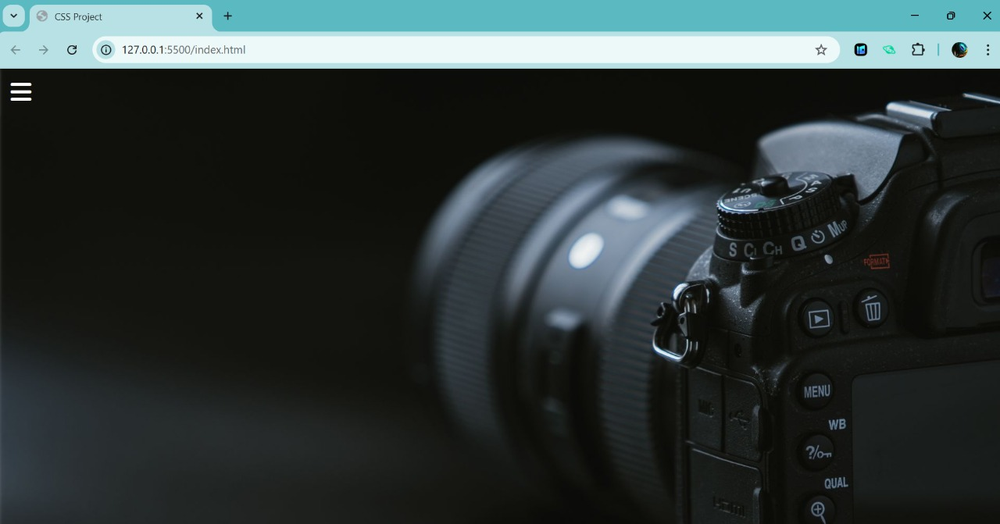

# Responsive Sidebar Menu (HTML + CSS)

This is a simple responsive sidebar menu created using only HTML and CSS — no JavaScript involved.

---

##  Before & After

###  Before (Sidebar Closed)

###  After (Sidebar Opened)

---

##  What’s Inside

- Hidden checkbox toggle system
- Smooth sidebar sliding animation
- Font Awesome icons
- Responsive and interactive design
- Social media icons with hover effects

---

## How to Run

1. Download or clone the project.
2. Make sure the background image (`photo.jpg`) is in the same folder.
3. Open `index.html` in your browser.

---

## ✨ Created By

Sneha Bhandari – for practice!!

