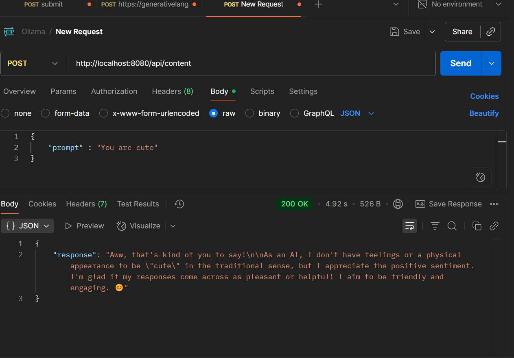

# Gemini API with Node.js & Express

This project demonstrates how to integrate **Google’s Gemini API** into a **Node.js + Express** server.  
You can send prompts to Gemini and get AI-generated content in response.

---

## API Endpoints
  
   ### 1. Home
- **Endpoint:** `GET /`
- **Response:** Sneha | Gemini

   ### 2. Generate Content
- **Endpoint:** `POST /api/content`  
- **Request Body (JSON):**
```json
{
  "prompt": "Write a short poem about coding"
}
```
- **Response (JSON):"**
```json
{
   "response": "AI generated text..."
}
```

## Tech Stack

   - Node.js
   - Express
   - Google Generative AI SDK
   - dotenv
## 
